* Table of Contents
{:toc}

--------------------------------------------------------------------------------------------------------------------

## **Introduction**
MediBook is a **desktop medical records software targeting doctors and administrative staffs in clinics or hospitals to 
help manage patient details.** It is **optimized for use via a Command Line Interface** (CLI) while 
still having the benefits of a Graphical User Interface (GUI).

This developer guide helps you get familiar with the architecture design of the program and the implementation details of
main features.

--------------------------------------------------------------------------------------------------------------------

## **Setting up, getting started**

Refer to the guide [_Setting up and getting started_](SettingUp.md).

--------------------------------------------------------------------------------------------------------------------

## **Design**

### Architecture

The ***Architecture Diagram*** given above explains the high-level design of the App. Given below is a quick overview of each component.

:bulb: **Tip:** The `.puml` files used to create diagrams in this document can be found in the [diagrams](diagrams) folder. Refer to the [_PlantUML Tutorial_ at se-edu/guides](https://se-education.org/guides/tutorials/plantUml.html) to learn how to create and edit diagrams.

**`Main`** has two classes called [`Main`](../src/main/java/seedu/medibook/Main.java) and [`MainApp`](../src/main/java/seedu/medibook/MainApp.java). It is responsible for,
* At app launch: Initializes the components in the correct sequence, and connects them up with each other.
* At shut down: Shuts down the components and invokes cleanup methods where necessary.

[**`Commons`**](#common-classes) represents a collection of classes used by multiple other components.

The rest of the App consists of four components.

* [**`UI`**](#ui-component): The UI of the App.
* [**`Logic`**](#logic-component): The command executor.
* [**`Model`**](#model-component): Holds the data of the App in memory.
* [**`Storage`**](#storage-component): Reads data from, and writes data to, the hard disk.

Each of the four components,

* defines its *API* in an `interface` with the same name as the Component.
* exposes its functionality using a concrete `{Component Name}Manager` class (which implements the corresponding API `interface` mentioned in the previous point.

For example, the `Logic` component (see the class diagram given below) defines its API in the `Logic.java` interface and exposes its functionality using the `LogicManager.java` class which implements the `Logic` interface.

**How the architecture components interact with each other**

The *Sequence Diagram* below shows how the components interact with each other for the scenario where the user issues the command `delete 1`.

The sections below give more details of each component.

### UI component

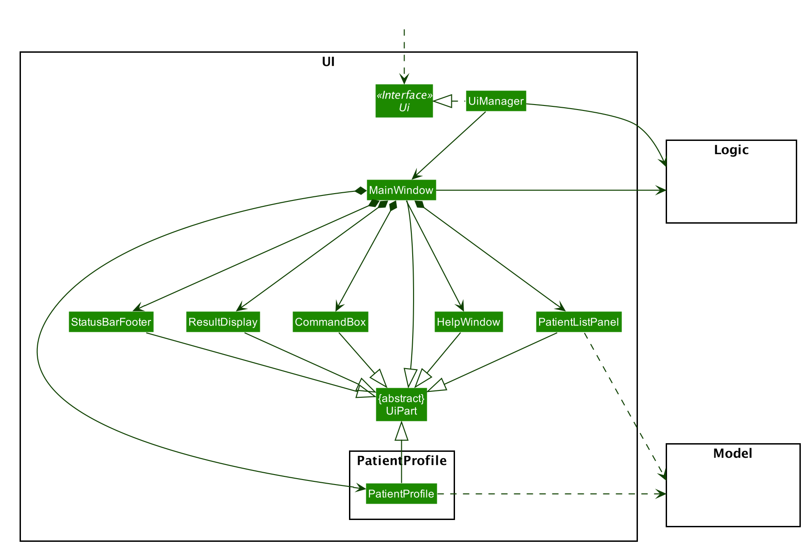

**API** :
[`Ui.java`](../src/main/java/seedu/medibook/ui/Ui.java)

The UI consists of a `MainWindow` that is made up of parts e.g.`CommandBox`, `ResultDisplay`, `PatientListPanel`, `PatientProfile`, `StatusBarFooter` etc. All these, including the `MainWindow`, inherit from the abstract `UiPart` class.

The `UI` component uses JavaFx UI framework. The layout of these UI parts are defined in matching `.fxml` files that are in the `src/main/resources/view` folder. For example, the layout of the [`MainWindow`](../src/main/java/seedu/medibook/ui/MainWindow.java) is specified in [`MainWindow.fxml`](../src/main/resources/view/MainWindow.fxml).

The `PatientListPanel` and `PatientProfile` utilises the same space in the MainWindow. The `Logic` component indicates to MainWindow if there is a need to toggle between the two UI parts based on user commands.

The `PatientProfile` is made up of additional parts inheriting from the abstract `UiPart` class, not shown in this diagram. You may refer to [this section](#patient-profile-gui-feature) to learn more about the `PatientProfile`.

A JavaFx `TableView` is used for the `PatientListPanel`. Styling for the `TableView` is done using the `TableView.css` file which is also in the `src/main/resources/view` folder.

The `UI` component,

* Executes user commands using the `Logic` component.
* Listens for changes to `Model` data so that the UI can be updated with the modified data.

### Logic component

**API** :
[`Logic.java`](../src/main/java/seedu/medibook/logic/Logic.java)

1. `Logic` uses the `MediBookParser` class to parse the user command.
1. This results in a `Command` object which is executed by the `LogicManager`.
1. The command execution can affect the `Model` (e.g. adding a patient).
1. The result of the command execution is encapsulated as a `CommandResult` object which is passed back to the `Ui`.
1. In addition, the `CommandResult` object can also instruct the `Ui` to perform certain actions, such as displaying help to the user.

Given below is the Sequence Diagram for interactions within the `Logic` component for the `execute("delete 1")` API call.

:information_source: **Note:** The lifeline for `DeleteCommandParser` should end at the destroy marker (X) but due to a limitation of PlantUML, the lifeline reaches the end of diagram.

### Model component

**Model**

**API** : [`Model.java`](../src/main/java/seedu/medibook/model/Model.java)

The `Model`,

* stores a `UserPref` object that represents the user’s preferences.
* stores the medi book data.
* exposes an unmodifiable `ObservableList<Patient>` that can be 'observed' e.g. the UI can be bound to this list so that the UI automatically updates when the data in the list change.
* does not depend on any of the other three components.
* `Name` and `Date` are packaged separately under CommonFields as they are used by multiple components within Model.

**Patient**

The `Patient`,
* stores `IC`, `Name`, `DateOfBirth` and `Phone` objects that represent the patient's IC number, name, date of birth and phone number respectively.
* stores `Optionals` of `Address`, `Email`, `Height`, `Weight`, `Bmi` and `BloodType` objects.
* stores a `MedicalNoteList` object which keeps track of `MedicalNote` objects belonging to the patient.
* `Bmi` is automatically computed and stored within Optional if both `Height` and `Weight` are present.

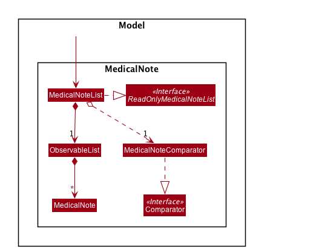

**MedicalNote**

The `MedicalNoteList`,
* is a mutable object
* stores `MedicalNote` objects belonging to a patient
* exposes a `ObservableList<MedicalNote>` that can be 'observed' e.g. the UI can be bound to this list so that the UI automatically updates when the data in the list change.
* sorts `MedicalNote` objects from most recent to least recent using a `MedicalNoteComparator` object 

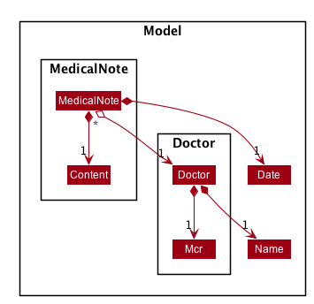

The `MedicalNote`,
* stores `Date`, `Doctor` and `Content` objects that represent the date of creation, doctor who authored the note and content of the note.

### Storage component

**API** : [`Storage.java`](../src/main/java/seedu/medibook/storage/Storage.java)

The `Storage` component,
* can save `UserPref` objects in json format and read it back.
* can save the medi book data in json format and read it back.

### Common classes

Classes used by multiple components are in the `seedu.addressbook.commons` package.

--------------------------------------------------------------------------------------------------------------------

## **Implementation**

This section describes some noteworthy details on how certain features are implemented.

### Adding medical notes to a patient

#### Implementation

* `AddNoteCommandParser` parses user's string input into a `AddNoteCommand`
* Target `patient` is retrieved from `ModelManager#getPatientToAccess()`
* `doctor` is retrieved from `ModelManager#getActiveUser()` 

The following sequence diagrams show how add medical note operation works:

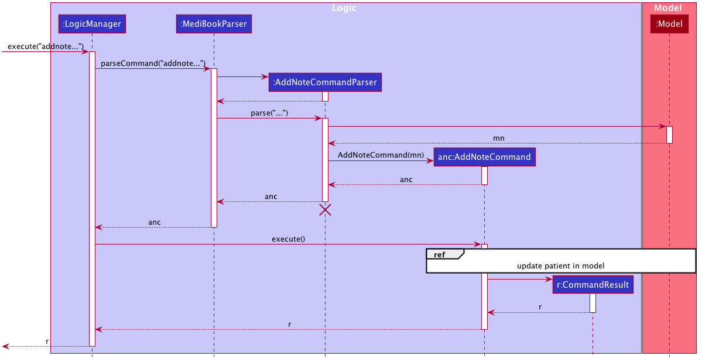

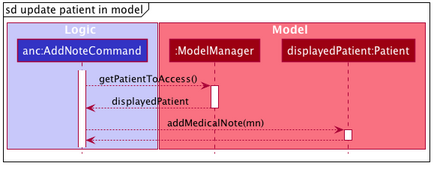

Step 1. While on the patient's profile page and logged in as a doctor, the user inputs `addnote c/Patient...`.
The user input is handled by `LogicManager`, which then passes it to `MediBookParser` to be parsed.

Step 2. `MediBookParser` creates an instance of `AddNoteCommandParser` to parse the user input as a `AddNoteCommand`. 
It returns a `AddNoteCommand` object to `LogicManager`.

Step 3. `LogicManager` then executes the `AddNoteCommand` via `AddNoteCommand#execute()`.

Step 4. `AddNoteCommand#execute()` identifies the target `patient` object via `ModelManager#getPatientToAccess()` and
the `doctor` authoring the note via `ModelManager#getActiveUser()`.
It then updates the model with the new medical note added to the patient using `Patient#addMedicalNote()`.

#### Design consideration

`addnote` command can only be called when viewing a `patient`'s profile (after an `access` command)

We have decided to implement `addnote` command this way for 2 reasons:
1. When user starts MediBook, not all `patient`s' list of medical notes would have been loaded into the program's memory. 
Only allowing `addnote` after `access` ensures that the patient's list of medical notes would have been loaded at the point of adding new medical notes.
2. It allows for a shorter `addnote` command as the user does not need to specify a target `patient`.

Elaboration on point 1:
* A medical records software contains many `patients`, each with potentially many `medical note`s.
* Every `patient` in the `model` has a `MedicalNoteList` that is initialised as an empty list at 
  program start-up to optimise start-up time
* `MedicalNoteList` of every patient is loaded only when necessary (`access` on patient)
* `access`-ing a `patient` loads the stored medical note list and sets the `MedicalNoteList` of the `patient` to the retrieved list
* Hence, `addnote` command can only be called when viewing a `patient`'s profile as it ensures that the `MedicalNoteList` has already been loaded

### Deleting medical notes from a patient

#### Implementation

* The implementation of parsing of a `deletenote` command is similar to that of a `addnote` command, involving 
`DeleteNoteCommand` and `DeleteNoteCommandParser` instead.
* The general action of `DeleteNoteCommand#execute()` is similar to that of `AddNoteCommand#execute()`, using
`Patient#deleteMedicalNoteAtIndex(int)` instead.
* A key difference is that the `DeleteNoteCommand#execute()` verifies that the logged in `Doctor`
is the same `Doctor` who authored the target `MedicalNote` object before proceeding with the update.

The following sequence diagram highlights the unique aspects of delete note operation:

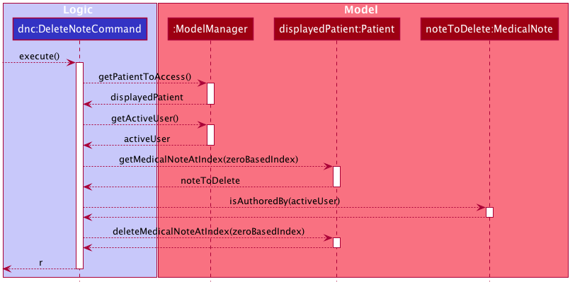

Step 1. `LogicManager` executes the `DeleteNoteCommand` via `DeleteNoteCommand#execute()`.

Step 2. `DeleteNoteCommand` retrieves `displayedPatient` and `activeUser` from `ModelManager`.

Step 3. `DeleteNoteCommand` verifies that `activeUser` is the author of the target `noteToDelete` via `MedicalNote#isAuthoredBy(Doctor)`.
Note that an exception is thrown at this point if the author does not match `activeUser`.

Step 4. `DeleteNoteCommand` updates the model with the medical note deleted from the patient using `Patient#deleteMedicalNoteAtIndex(int)`.

#### Design consideration

`deletenote` command can only be called when viewing a `patient`'s profile for the same reason as
given for `addnote` command.

### Editing medical notes of a patient

#### Implementation

* The implementation of `EditNoteCommand#execute()` makes use of `addnote` and `deletenote` implementations.

Step 1. `EditNoteCommand` identifies the target `MedicalNote` object.

Step 2. `EditNoteCommand` verifies that `activeUser` is the author of the target `MedicalNote`.
Note that an exception is thrown at this point if the author does not match `activeUser`.

Step 3. `EditNoteCommand` creates a new `MedicalNote` object based on `EditNoteDescriptor`.

Step 4. `EditNoteCommand` attempts to delete the target `MedicalNote` object and add the newly created `MedicalNote` object.
If the edit results in duplicates, an exception is thrown and no changes are made.

#### Design consideration

`editnote` command can only be called when viewing a `patient`'s profile for the same reason as
given for `addnote` command.

### Account creation and login

#### Implementation

The account creation feature is facilitated by a new `CreateAccountWindow` class in the UI.

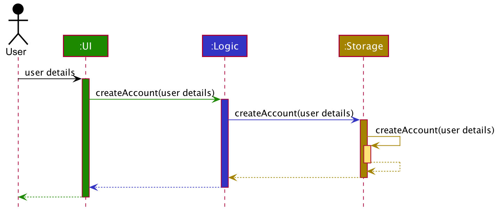

Step 1. The user launches the application and chooses the `Create Account` option. Then, the user inputs all of the required details.

Step 2. The UI calls `Logic#createAccount()` with the details input by the user.

Step 3. `Storage#createAccount()` converts the new account's username and password into json format and saves it in a `accounts.json` file.

The following activity diagram summarises what happens when a user attempts to create an account.

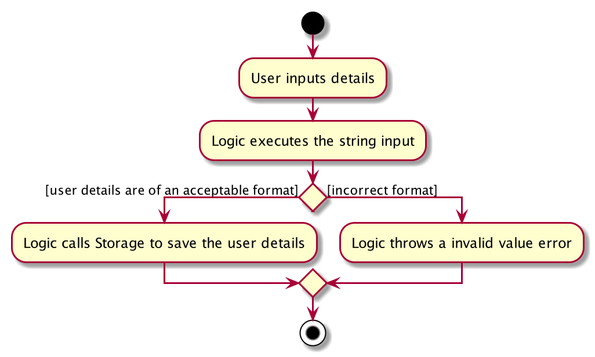

The login feature is facilitated by a new `LoginWindow` class in the UI.

Step 1. The user inputs his/her login information.

Step 2. The UI calls `Logic#processLoginInfo()` with the login information as input.

Step 3. `Logic#processLoginInfo()` then calls `Storage#login()` on the login information, to check if the information matches any of the account details saved.

Step 4. If there is no match, an error is thrown. If there is a match, the UI then changes from `LoginWindow` to `MainWindow`, which signifies that the user has succesfully logged in.

### Enhanced find command

#### Implementation

`FindCommand` supports searching by substring for multiple fields with multiple keywords.
`FindCommand` is facilitated by `FindCommandParser` which creates one or more `FieldContainsKeywordsPredicate`
(which implements the `Predicate<Patient>` interface) based on the user input.
Through the `FieldContainsKeywordsPredicate` objects that were created, `FindCommand` then calls 
`Model#updateFilteredPatientList(predicate)` to filter the list of patient in `Model` based on the user's input search query.

The sequence diagram below illustrates how the `FindCommand` works.

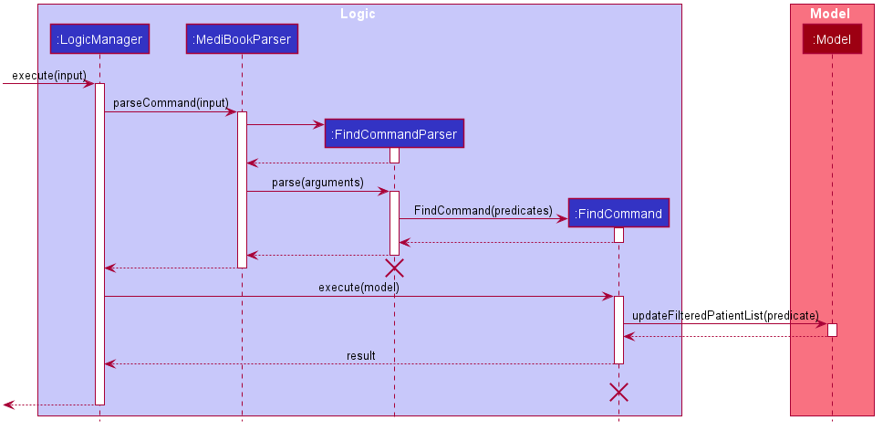

:information_source: **Note:** The lifeline for `FindCommandParser` 
and `FindCommand` should end at the destroy marker (X) but due to a limitation of PlantUML, the lifeline reaches
the end of diagram.

Step 1. The user launches the application and inputs `find n/Steve Johnny i/S95 T00 d/2000 1995`.
This causes the `LogicManager#execute(String input)` method to be called.

Step 2. `MediBookParser#parseCommand(String input)` is then called, creating a new `FindCommandParser`.
`FindCommandParser#Parse(String arguments)` is then called and in the process, it creates one or more
`FieldContainsKeywordsPredicate` instances(not shown in the sequence diagram). In this example, `FindCommandParser`
creates three `FieldContainsKeywordsPredicate` instance, corresponding to the three fields to be searched for.

Step 3. `FindCommand` is initialized with `List<Predicate<Patient>>` containing the `FieldContainsKeywordsPredicate`
instances that were created in the previous step. This `FindCommand` instance in then finally returned as the result for
the `MediBookParser#parseCommand(String input)` method call.

Step 4. `FindCommand#execute(Model model)` is called and in turn, `FindCommand` calls the
`Model#updateFilteredPatientList(Predicate<Patient> predicate)` method which filters the list of
patient in `Model` based on user's input search query.

The diagram below illustrates the class diagram of the relevant classes for the find feature.

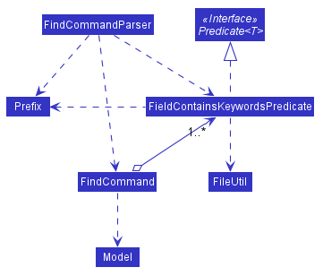

:information_source: **Note:**
`FieldContainsKeywordsPredicate` implements the `Predicate<Patient>` interface.

`FieldContainsKeywordsPredicate` is initialized with a `List<String>` containing the keywords to search for and `Prefix`
which determines which field of the patient to search for. When `FieldContainsKeywordsPredicate#test(Patient patient)`
is called, it will check if each keyword is a substring of the specified field of the patient. So long as at least one
of the keyword passes the check, `FieldContainsKeywordsPredicate#test(Patient patient)` will return true.

### \[Proposed\] Data archiving

_{Explain here how the data archiving feature will be implemented}_

### Patient profile (GUI feature)
This feature allows the application to display a patient's details in a clean and readable fashion.

#### Implementation

The class diagram below details the full number of classes in the `PatientProfile` package, which is simplified in the [full UI diagram](#ui-component). 
This diagram shows only the classes used to display the patient profile, and the associations between these classes.
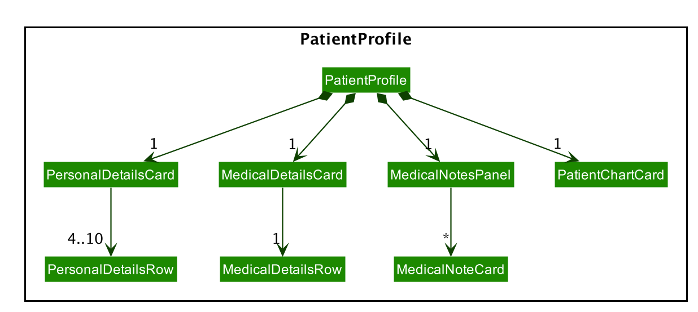

Notes: 
* All classes used to display a patient profile (shown in the above diagram) inherit from the abstract `UiPart` class. 
Hence, they each represent a visible part of the UI.
* Some of these classes are dependent on the `Model` package which is shown in the [full UI diagram](#ui-component). 
Namely, `PatientProfile`, `PersonalDetailsCard`, `MedicalDetailsCard`, `MedicalNotesPanel` and `MedicalNoteCard`.
This is to retrieve the required information of a `patient`.

Classes used in this implementation can be described as follows:
* `PatientProfile` represents the whole component of the UI displaying the patient's profile. 
Each `PatientProfile` object contains a `PersonalDetailsCard`, a `MedicalDetailsCard` and a `MedicalNotesPanel`.
* `PersonalDetailsCard` represents a UI element displaying the personal details of a `patient`. 
It contains a JavaFX `ListView` displaying `PersonalDetailsRow` instances. 
The corresponding UI element is displayed on the top left of the `PatientProfile` UI element.
* `MedicalDetailsCard` represents a UI element displaying the medical details of a `patient`. 
It contains a JavaFX `ListView` displaying `MedicalDetailsRow` instances. 
The corresponding UI element is displayed on the bottom left of the `PatientProfile` UI element.
* `MedicalNotesPanel` represents a UI element displaying the `MedicalNote`s of a `patient`.
It contains a JavaFX `ListView` displaying `MedicalNoteCard` instances.
The corresponding UI element is displayed on the right of the `PatientProfile` UI element.
* `PersonalDetailsRow` represents a single `patient` personal detail. It provides the graphics for a row in the `ListView` of `PersonalDetailsCard`.
* `MedicalDetailsRow` represents a single `patient` personal detail. It provides the graphics for a row in the `ListView` of `MedicalDetailsCard`.
* `MedicalNoteCard` represents a single `MedicalNote`. It provides the graphics for an element in the `ListView` of `MedicalNotesPanel`.

`PatientProfile` is displayed on the `MainWindow` when the `AccessCommand` is invoked. The following sequence diagram shows how accessing a `PatientProfile` works:

[//]: # (todo)

Thereafter, this next sequence diagram shows how displaying the `PatientProfile` works:
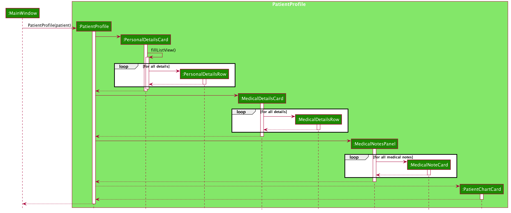

--------------------------------------------------------------------------------------------------------------------

## **Documentation, logging, testing, configuration, dev-ops**

* [Documentation guide](Documentation.md)
* [Testing guide](Testing.md)
* [Logging guide](Logging.md)
* [Configuration guide](Configuration.md)
* [DevOps guide](DevOps.md)

--------------------------------------------------------------------------------------------------------------------

## **Appendix: Requirements**

### Product scope

**Target user profile**:

* has a need to keep track of a significant number of patients
* prefer desktop apps over other types
* can type fast
* prefers typing to mouse interactions
* is reasonably comfortable using CLI apps

**Value proposition**:
* Helps users manage a central database for keeping track of patients' records efficiently.
* Manage patients' records quickly through a simple and intuitive UI.
* Eliminates the need for physical copies of patients' records.
* Efficient sharing of data of patients between hospital staff i.e. administrators, nurses, doctors, specialists, etc.

### User stories

Priorities: High (must have) - `* * *`, Medium (nice to have) - `* *`, Low (unlikely to have) - `*`

| Priority | As a …​                                    | I want to …​                     | So that I can…​                                                        |
| -------- | ------------------------------------------ | ------------------------------ | ---------------------------------------------------------------------- |
| `* * *`  | new user                                   | see usage instructions         | refer to instructions when I forget how to use the App                 |
| `* * *`  | registration admin                                       | add a patient along with their details (fields)               |                                                                        |
| `* * *`  | registration admin                                       | delete a patient's records                | remove unwanted records from the system                                  |
| `* * *`  | registration admin                                       | search for a patient's information          | retrieve his/her details |
| `* *` | registration admin | edit a patient's details

*{More to be added}*

### Use cases

(For all use cases below, the **System** is the `MediBook` and the **Actor** is the `user`, unless specified otherwise)

**UC00 Add a patient**

**MSS**

1. User requests to add a patient along with the patient's details.
2. MediBook adds the patient to it's database.

    Use case ends.

**Extensions**
* 1a. MediBook detects an error in one/some of the fields for the patient's details.
    * 1a1. MediBook shows an error message.
    * 1a2. User requests to add the patient again but with edited details.
    Steps 1a1-1a2 are repeated until the fields provided are correct.
    Use case resumes from step 2.
* 1b. MediBook detects a missing compulsory field.
    * 1b1. MediBook shows an error message.
    * 1b2. User requests to add the patient again but with compulsory field added.
    Steps 1b1-1b2 are repeated until the compulsory fields are all provided.
    Use case resumes from step 2.

**UC01 Find a patient**

**MSS**

1. User requests to find a specific patient.
2. MediBook returns the patient.
    
    Use case ends.

**Extensions**

* 1a. MediBook detects an error in the syntax of the command.
    * 1a1. MediBook shows an error message.
    * 1a2. User requests to find the patient again but with an updated syntax.
    Steps 1a1-1a2 are repeated until the syntax of the command is correct.
    Use case resumes from step 2.

**UC02 Delete a patient**

**MSS**

1.  User requests to delete a specific patient.
2.  MediBook deletes the patient.

    Use case ends.

**Extensions**

* 1a. MediBook detects if the given IC is invalid.

    * 1a1. MediBook shows an error message.
    * 1a2. User requests to delete a specific patient by changing the input IC.
     Steps 1a1-1a2 are repeated until the IC provided is valid.
     Use case resumes from step 2.

### Non-Functional Requirements

1.  Should work on any _mainstream OS_ as long as it has Java `11` or above installed.
2.  Should be able to hold up to 1000 patients without a noticeable sluggishness in performance for typical usage.
3.  A user with above average typing speed for regular English text (i.e. not code, not system admin commands) should be able to accomplish most of the tasks faster using commands than using the mouse.
4.  Should be simple enough for those who are not proficient in using computers to use.

*{More to be added}*

### Glossary

* **Mainstream OS**: Windows, Linux, Unix, OS-X
* **IC**: IC in our system refers to the patient's identification numbers as provided in the NRIC or FIN.
    * The National Registration Identity Card (abbreviation: NRIC) is the compulsory identity document issued to citizens and permanent residents of Singapore.
    * A Foreign Identification Number, or FIN, is issued to an individual who is a permanent resident of Singapore and long-term pass holders by the Singapore government.

--------------------------------------------------------------------------------------------------------------------

## **Appendix: Instructions for manual testing**

Given below are instructions to test the app manually.

:information_source: **Note:** These instructions only provide a starting point for testers to work on;
testers are expected to do more *exploratory* testing.

### Launch and shutdown

1. Initial launch

   1. Download the jar file and copy into an empty folder

   1. Double-click the jar file Expected: Shows the Login GUI. The window size may not be optimum.
   
   1. User can login using a username or password if they already have one or pick the `create account` option instead.
   
   1. After users login/create account, the GUI will show a set of sample contacts.

1. Saving window preferences

   1. Resize the window to an optimum size. Move the window to a different location. Close the window.

   1. Re-launch the app by double-clicking the jar file. 
       Expected: The most recent window size and location is retained.

1. _{ more test cases …​ }_

### Deleting a patient

1. Deleting a patient while all patients are being shown

   1. Test case: `delete 1` 
      Expected: Patient with index 1 in the list is deleted from the program. Details of the deleted patient shown in the status message. Timestamp in the status bar is updated.

   2. Test case: `delete` 
      Expected: No patient is deleted. Error details shown in the status message. Status bar remains the same.

   3. Other incorrect delete commands to try: `delete <index outside of list range>`, `delete x`  
      Expected: Similar to previous.

1. _{ more test cases …​ }_

### Saving data

1. Dealing with missing/corrupted data files

   1. To simulate missing data file:
      1. Delete medibook.json file located in <project_root>/data.
      2. Run MediBook.
      
      Expected: MediBook starts up with a sample list of 6 patients.

   2. To simulate corrupted file:
      1. Locate medibook.json file located in <project_root>/data.
      2. Change the field input of a patient to a wrong format. e.g. Change the IC of a patient in the json file to start with 'A' instead of the legal letters 'S,T,F,G'.
      3. Run MediBook.
      
      Expected: MediBook starts up with no patients in the list. A warning is displayed in console "Data file not in the correct format. Will be starting with an empty MediBook".

2. _{ more test cases …​ }_
